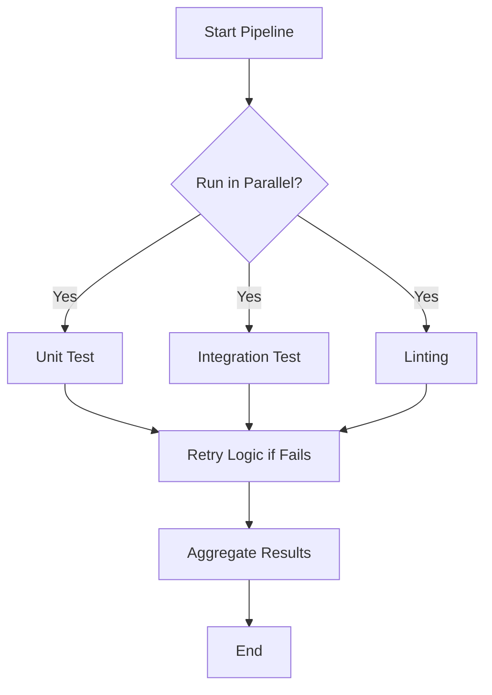
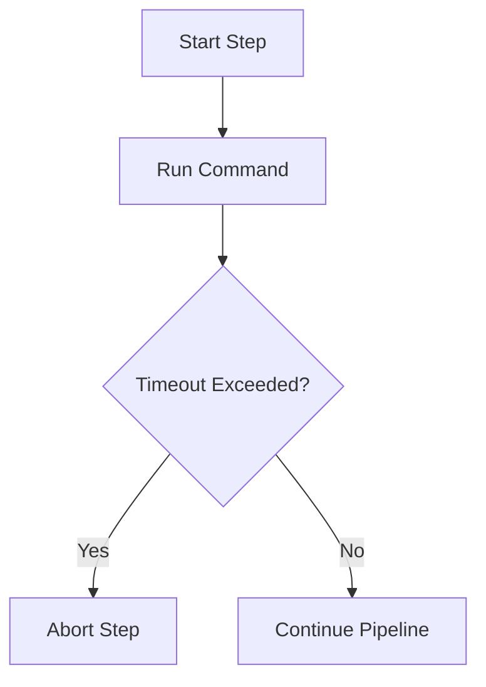

# Jenkins Advanced Pipeline Features

This guide extends your Jenkins knowledge with advanced pipeline features that provide more control, flexibility, and efficiency to your CI/CD workflows.

---

## 📌 Table of Contents

1. [Scheduled Builds with Cron](#cron)
2. [Retry Logic](#retry)
3. [Timeouts for Steps](#timeout)
4. [Parallel Execution](#parallel)
5. [Diagram Summary](#diagrams)

---

## ⏲️ Scheduled Builds with Cron <a name="cron"></a>

Use the `cron` trigger to run your pipeline periodically.

```groovy
pipeline {
  triggers {
    cron('H 4 * * 1-5') // Runs at 4:00 AM Monday through Friday
  }
  agent any
  stages {
    stage('Scheduled Task') {
      steps {
        echo 'This job runs on schedule.'
      }
    }
  }
}
```

* `H`: Jenkins hash (avoids all jobs starting at the exact same time)
* `1-5`: Days Monday (1) to Friday (5)

---

## 🔁 Retry Logic <a name="retry"></a>

The `retry` block helps you re-run flaky steps a number of times before failing.

```groovy
steps {
  retry(3) {
    sh 'curl --fail http://unstable-service/api'
  }
}
```

* Useful when integrating with unstable services.
* Stops retrying on success.

---

## ⏳ Timeout for Steps <a name="timeout"></a>

Prevent long-running steps from hanging your pipeline.

```groovy
steps {
  timeout(time: 10, unit: 'MINUTES') {
    sh './slow-script.sh'
  }
}
```

* Can be set per `stage`, `step`, or whole pipeline.

---

## 🔀 Parallel Execution <a name="parallel"></a>

Run multiple jobs at the same time to speed up your pipeline.

```groovy
pipeline {
  agent any
  stages {
    stage('Parallel Testing') {
      parallel {
        stage('Unit Tests') {
          steps {
            sh 'npm run test:unit'
          }
        }
        stage('Integration Tests') {
          steps {
            sh 'npm run test:integration'
          }
        }
        stage('Linting') {
          steps {
            sh 'npm run lint'
          }
        }
      }
    }
  }
}
```

* Each `parallel` stage runs in its own executor.
* Use labels or agents to isolate environments if needed.

---

## 🧭 Diagram Summary <a name="diagrams"></a>

### Parallel and Retry Flow



### Timeout Example Flow



---