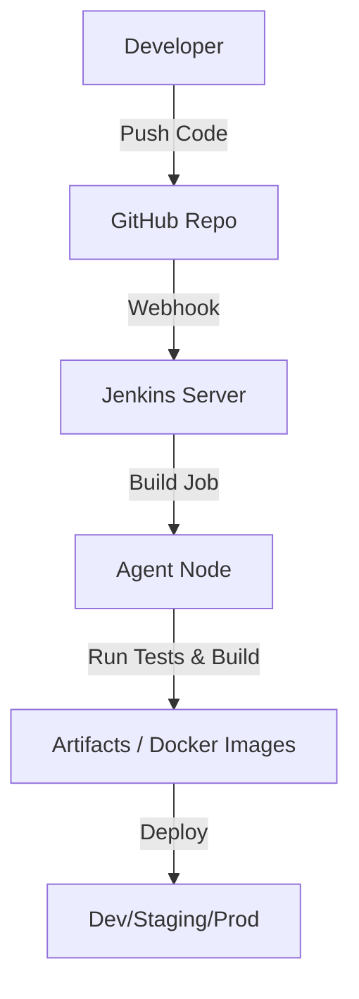
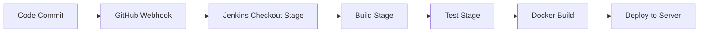
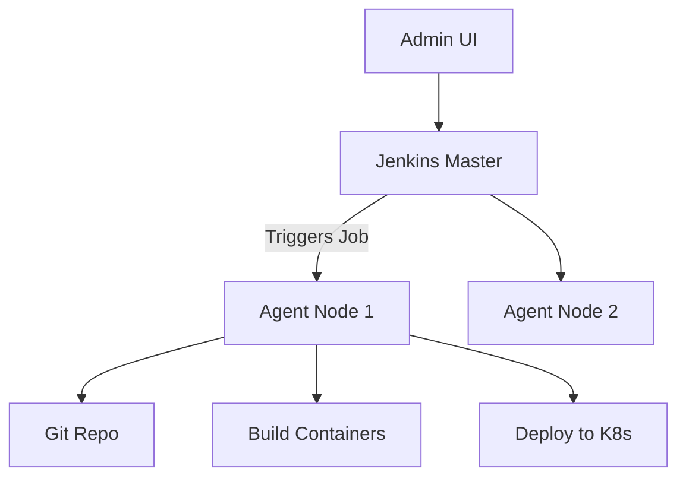

# Jenkins Full Tutorial

##  Table of Contents

1. [Introduction to Jenkins](#introduction)
2. [Jenkins Architecture](#architecture)
3. [Installing Jenkins](#installation)
4. [First Jenkins Job](#first-job)
5. [Jenkins Pipeline](#pipeline)
6. [Declarative vs Scripted Pipelines](#pipeline-types)
7. [Plugins in Jenkins](#plugins)
8. [Integrating with GitHub](#github-integration)
9. [Docker and Jenkins](#docker)
10. [CI/CD Pipeline Example](#ci-cd-example)
11. [Common Jenkins Commands](#commands)
12. [Best Practices](#best-practices)
13. [Diagram Summary](#diagrams)
14. [Resources](#resources)

---

## 🔧 Introduction to Jenkins <a name="introduction"></a>

Jenkins is an **open-source automation server** used to automate tasks related to building, testing, and deploying software. It supports **continuous integration (CI)** and **continuous delivery (CD)**.

### Why Jenkins?

* Automates repetitive tasks
* Integrates with version control tools
* Supports distributed builds
* Huge plugin ecosystem

---

## 🏗️ Jenkins Architecture <a name="architecture"></a>



* **Master Node**: Controls the jobs and orchestrates builds.
* **Agent Node**: Executes the build and test jobs.
* **Jenkinsfile**: Pipeline definition as code.

---

## 🧰 Installing Jenkins <a name="installation"></a>

### ✅ Pre-requisites

* Java (JDK 11+)
* Linux or Windows machine

### 📦 Installation on Ubuntu

```bash
sudo apt update
sudo apt install openjdk-11-jdk
wget -q -O - https://pkg.jenkins.io/debian-stable/jenkins.io.key | sudo apt-key add -
sudo sh -c 'echo deb https://pkg.jenkins.io/debian-stable binary/ > /etc/apt/sources.list.d/jenkins.list'
sudo apt update
sudo apt install jenkins
sudo systemctl start jenkins
sudo systemctl enable jenkins
```

Visit: `http://<your-server-ip>:8080`

---

## 🚀 Your First Jenkins Job <a name="first-job"></a>

1. Open Jenkins Dashboard
2. Click on **New Item**
3. Name it `hello-world`, choose **Freestyle Project**
4. Under **Build**, select **Execute shell**:

```bash
echo "Hello, Jenkins!"
```

5. Click **Save** and then **Build Now**
6. Check **Console Output** for logs

---

## 🔄 Jenkins Pipeline <a name="pipeline"></a>

Jenkins Pipelines are used to define **step-by-step CI/CD workflows**.

### 🔤 Basic Syntax (Declarative Pipeline)

```groovy
pipeline {
  agent any

  stages {
    stage('Build') {
      steps {
        echo 'Building...'
      }
    }

    stage('Test') {
      steps {
        echo 'Testing...'
      }
    }

    stage('Deploy') {
      steps {
        echo 'Deploying...'
      }
    }
  }
}
```

---

## 🧬 Declarative vs Scripted Pipelines <a name="pipeline-types"></a>

| Feature          | Declarative         | Scripted               |
| ---------------- | ------------------- | ---------------------- |
| Syntax Style     | Simpler, structured | Flexible, Groovy-based |
| Recommended for  | Most users          | Advanced use cases     |
| Jenkinsfile Type | `pipeline {}` block | `node {}` block        |

---

## 🔌 Jenkins Plugins <a name="plugins"></a>

Plugins extend Jenkins capabilities.

### Popular Plugins

* GitHub Integration
* Docker Pipeline
* Slack Notifications
* Blue Ocean UI

Install via: `Manage Jenkins → Manage Plugins`

---

## 🔗 GitHub Integration <a name="github-integration"></a>

### Steps:

1. Install **GitHub plugin**
2. Configure credentials in Jenkins (GitHub token)
3. Create a GitHub Webhook
4. Use `git` command in Jenkinsfile:

```groovy
pipeline {
  agent any
  stages {
    stage('Checkout') {
      steps {
        git url: 'https://github.com/your-repo.git'
      }
    }
  }
}
```

---

## 🐳 Jenkins with Docker <a name="docker"></a>

Run Jenkins in Docker:

```bash
docker volume create jenkins_home

docker run -d \
  -u root \
  -v /var/run/docker.sock:/var/run/docker.sock \
  -v jenkins_home:/var/jenkins_home \
  -p 8080:8080 -p 50000:50000 \
  --name jenkins \
  jenkins/jenkins:lts
```

Access Jenkins on `localhost:8080`

---

## 🌐 CI/CD Pipeline Example <a name="ci-cd-example"></a>

```groovy
pipeline {
  agent any

  environment {
    APP_NAME = 'my-app'
  }

  stages {
    stage('Checkout') {
      steps {
        git 'https://github.com/user/repo.git'
      }
    }

    stage('Build') {
      steps {
        sh 'npm install'
      }
    }

    stage('Test') {
      steps {
        sh 'npm test'
      }
    }

    stage('Docker Build') {
      steps {
        sh 'docker build -t my-app .'
      }
    }

    stage('Deploy') {
      steps {
        sh 'docker run -d -p 80:80 my-app'
      }
    }
  }
}
```

---

## 📋 Common Jenkins CLI Commands <a name="commands"></a>

```bash
jenkins-cli.jar -s http://localhost:8080/ help
jenkins-cli.jar -s http://localhost:8080/ list-jobs
jenkins-cli.jar -s http://localhost:8080/ build job-name
```

---

## ✅ Best Practices <a name="best-practices"></a>

* Always use a `Jenkinsfile`
* Use **parameterized builds**
* Store credentials securely in Jenkins Credentials Manager
* Isolate jobs with containers
* Clean up old builds regularly

---

## 🧭 Diagram Summary <a name="diagrams"></a>

### Jenkins CI/CD Pipeline Flow



### Jenkins System Architecture



---
